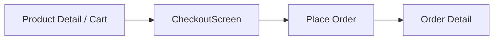
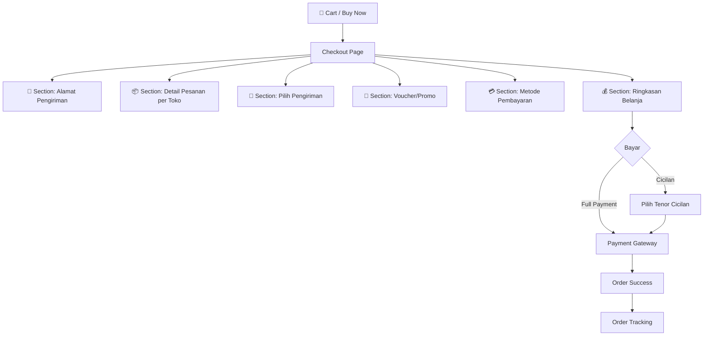
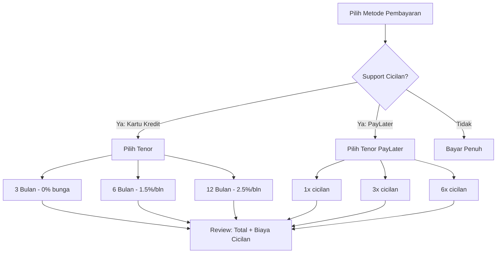
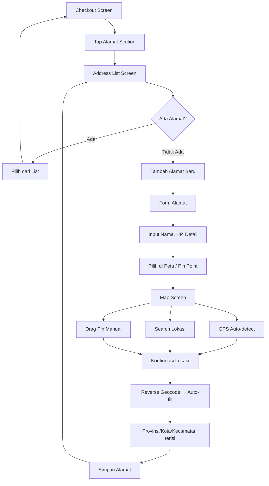
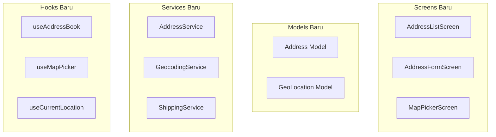
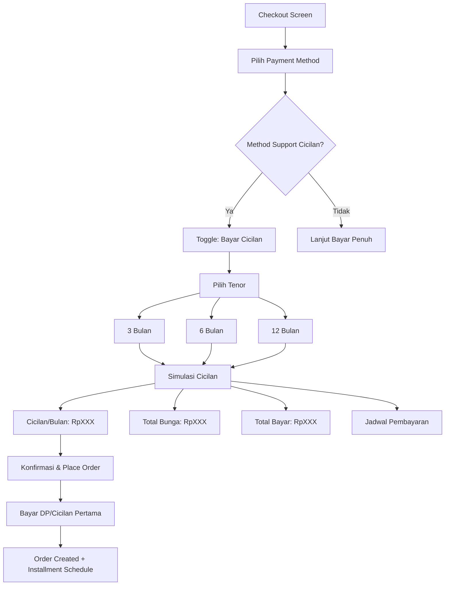
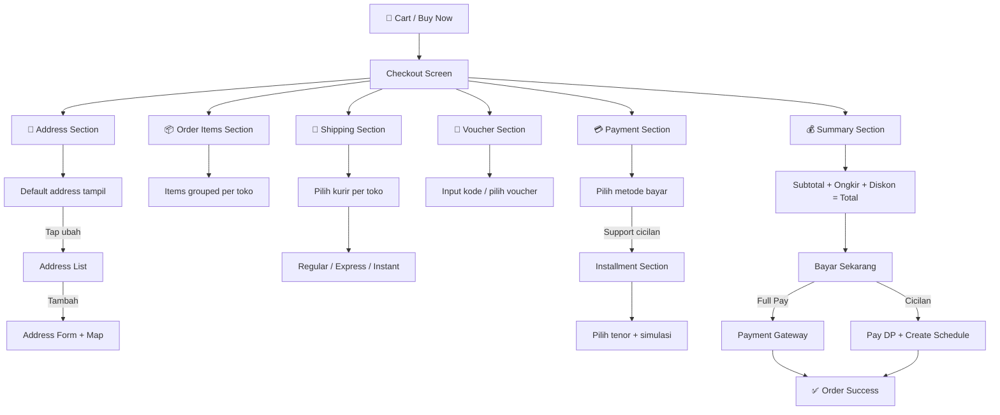

# Analisis Mendalam: Flow Checkout Marketplace

> Analisis lengkap flow checkout, cicilan, dan setting alamat dengan map pick point — benchmarking Tokopedia & Shopee

---

## 1. Kondisi Saat Ini (Current State)

### Checkout Flow Sekarang



**Yang sudah ada di codebase:**

| Fitur             | Status       | Detail                              |
| ----------------- | ------------ | ----------------------------------- |
| Order Summary     | ✅ Ada       | Produk, qty, subtotal, shipping fee |
| Alamat Pengiriman | ⚠️ Minimal   | Text input saja, tidak ada map/GPS  |
| Payment Method    | ✅ Ada       | COD, Transfer, E-Wallet             |
| Cicilan           | ⚠️ Minimal   | Toggle on/off, split 2x saja        |
| Voucher/Kupon     | ❌ Tidak ada | —                                   |
| Shipping Options  | ❌ Tidak ada | Ongkir hardcoded Rp15.000           |
| Proteksi/Asuransi | ❌ Tidak ada | —                                   |
| Pick Point Maps   | ❌ Tidak ada | Tidak ada komponen map              |
| Address Book      | ❌ Tidak ada | Tidak ada list alamat tersimpan     |

### File Terkait

| File                                                                                                                                                                    | Ukuran    | Fungsi                |
| ----------------------------------------------------------------------------------------------------------------------------------------------------------------------- | --------- | --------------------- |
| [CheckoutScreen.tsx](file:///Users/macbookm2/Documents/TKI/member-closepay-expo/packages/plugins/marketplace/components/screens/CheckoutScreen.tsx)                     | 581 lines | Screen checkout utama |
| [MarketplaceOrder.ts](file:///Users/macbookm2/Documents/TKI/member-closepay-expo/packages/plugins/marketplace/models/MarketplaceOrder.ts)                               | 40 lines  | Model order           |
| [MarketplaceInstallment.ts](file:///Users/macbookm2/Documents/TKI/member-closepay-expo/packages/plugins/marketplace/models/MarketplaceInstallment.ts)                   | 14 lines  | Model cicilan         |
| [marketplaceOrderService.ts](file:///Users/macbookm2/Documents/TKI/member-closepay-expo/packages/plugins/marketplace/services/marketplaceOrderService.ts)               | 48 lines  | Service CRUD order    |
| [marketplaceInstallmentService.ts](file:///Users/macbookm2/Documents/TKI/member-closepay-expo/packages/plugins/marketplace/services/marketplaceInstallmentService.ts)   | 52 lines  | Service cicilan       |
| [MarketplaceCicilanScreen.tsx](file:///Users/macbookm2/Documents/TKI/member-closepay-expo/packages/plugins/marketplace/components/screens/MarketplaceCicilanScreen.tsx) | 280 lines | Layar daftar cicilan  |

---

## 2. Benchmark: Flow Checkout Tokopedia & Shopee

### 2.1 Full Checkout Flow (Tokopedia)



### 2.2 Detail Setiap Section

#### 📍 A. Alamat Pengiriman (Shipping Address)

**Tokopedia:**

- Menampilkan alamat utama (default) di atas checkout
- Tap untuk ganti → buka **Address List** (daftar alamat tersimpan)
- Bisa tambah alamat baru → form alamat + **map pick point**
- Map features: search lokasi, drag pin, auto-detect current location (GPS)
- Alamat detail: label (Rumah/Kantor/custom), nama penerima, no HP, provinsi/kota/kecamatan, kode pos, detail alamat, catatan kurir
- Pin point wajib untuk kurangi salah kirim

**Shopee:**

- Sama seperti Tokopedia
- Ada fitur **"Alamat Saya"** di profil
- Tambahan: validasi RT/RW, patokan lokasi
- Pick Point bisa dari kamera (scan barcode lokasi partner)

**Gap Analysis vs Current:**

| Fitur            | Tokopedia/Shopee                   | Closepay Sekarang             | Gap       |
| ---------------- | ---------------------------------- | ----------------------------- | --------- |
| Address List     | ✅ Multi-alamat tersimpan          | ❌ Input teks setiap checkout | 🔴 Major  |
| Map Pick Point   | ✅ Google Maps + GPS               | ❌ Tidak ada                  | 🔴 Major  |
| Default Address  | ✅ Alamat utama otomatis           | ❌ Tidak ada                  | 🔴 Major  |
| Label Address    | ✅ Rumah/Kantor/Custom             | ❌ Tidak ada                  | 🟡 Medium |
| Penerima Contact | ✅ Nama + HP terpisah              | ❌ Tidak ada                  | 🟡 Medium |
| Auto-fill Area   | ✅ Provinsi/Kota/Kecamatan cascade | ❌ Tidak ada                  | 🟡 Medium |
| Catatan Kurir    | ✅ Ada                             | ❌ Tidak ada                  | 🟢 Minor  |

---

#### 🚚 B. Pilihan Pengiriman (Shipping Options)

**Tokopedia:**

- Per toko → pilih kurir: JNE, J&T, SiCepat, GoSend, GrabExpress, dll
- Setiap kurir punya tiers: Regular, Express, Same Day, Instant
- Estimasi ongkir real-time berdasarkan berat + lokasi
- Free ongkir badge (subsidi platform/seller)

**Shopee:**

- Sama + Shopee Express (kurir internal)
- Voucher gratis ongkir otomatis di-apply
- Estimasi waktu tiba

**Gap Analysis:**

| Fitur            | Tokopedia/Shopee              | Closepay           | Gap       |
| ---------------- | ----------------------------- | ------------------ | --------- |
| Multi-Kurir      | ✅ 5-10 pilihan               | ❌ Hardcoded Rp15K | 🔴 Major  |
| Tier Pengiriman  | ✅ Regular/Express/Instant    | ❌ Tidak ada       | 🔴 Major  |
| Kalkulasi Ongkir | ✅ Real-time (berat + lokasi) | ❌ Flat fee        | 🟡 Medium |
| Free Ongkir      | ✅ Ada                        | ❌ Tidak ada       | 🟢 Minor  |
| Estimasi Tiba    | ✅ Ada                        | ❌ Tidak ada       | 🟡 Medium |

---

#### 💳 C. Metode Pembayaran (Payment Methods)

**Tokopedia:**

| Kategori           | Detail                                |
| ------------------ | ------------------------------------- |
| E-Wallet           | GoPay, OVO, ShopeePay, DANA, LinkAja  |
| Virtual Account    | BCA, BNI, Mandiri, BRI, dsb           |
| Transfer Bank      | Manual transfer                       |
| Kartu Kredit/Debit | Visa, Mastercard, JCB                 |
| Cicilan            | Kartu kredit (3/6/12 bulan), PayLater |
| COD                | Cash on Delivery                      |
| Gerai/Counter      | Alfamart, Indomaret                   |
| Saldo              | OVO Points, TokoCash                  |

**Shopee:**

- ShopeePay, SPaylater, kartu kredit, VA, COD, transfer bank
- SPayLater: cicilan 1x/3x/6x/12x

**Gap Analysis:**

| Fitur           | Tokopedia/Shopee  | Closepay                | Gap       |
| --------------- | ----------------- | ----------------------- | --------- |
| E-Wallet        | ✅ Multi-provider | ✅ Ada (1 opsi)         | 🟡 Medium |
| Virtual Account | ✅ Multi-bank     | ❌ Tidak ada            | 🔴 Major  |
| Kartu Kredit    | ✅ Ada            | ❌ Tidak ada            | 🟡 Medium |
| Saldo Internal  | ✅ Ada            | ✅ Ada (payWithBalance) | ✅ OK     |
| COD             | ✅ Ada            | ✅ Ada                  | ✅ OK     |
| Transfer        | ✅ Ada            | ✅ Ada                  | ✅ OK     |

---

#### 💰 D. Cicilan (Installment) — **DETAIL MENDALAM**

**Tokopedia:**



**Detail Fitur Cicilan Marketplace Matang:**

| Aspek                 | Detail                                                             |
| --------------------- | ------------------------------------------------------------------ |
| **Tenor Options**     | 3, 6, 9, 12, 18, 24 bulan                                          |
| **Interest Rate**     | 0% (promo), 1-2.5%/bulan (normal)                                  |
| **Min. Transaksi**    | Ada minimum (biasanya Rp500K-1JT)                                  |
| **Provider**          | Kartu kredit (BCA, Mandiri, dll), PayLater (GoPaylater, SPaylater) |
| **Breakdown Display** | Total, bunga, biaya admin, cicilan/bulan                           |
| **Simulasi**          | User bisa lihat simulasi sebelum pilih                             |
| **Early Payment**     | Bisa bayar lebih awal (beberapa provider)                          |
| **Auto-debit**        | Debit otomatis tiap bulan                                          |
| **Overdue**           | Denda keterlambatan, notifikasi menjelang jatuh tempo              |
| **Status Tracking**   | Sisa cicilan, next payment, history pembayaran                     |

**Current Closepay vs Target:**

| Fitur            | Target (Tokopedia-like) | Closepay Sekarang | Gap       |
| ---------------- | ----------------------- | ----------------- | --------- |
| Tenor pilihan    | 3/6/12 bulan            | 2x split saja     | 🔴 Major  |
| Interest rate    | Per tenor + promo 0%    | Tidak ada bunga   | 🟡 Medium |
| Min. transaksi   | Ada threshold           | Tidak ada         | 🟡 Medium |
| Simulasi         | Real-time preview       | Tidak ada         | 🔴 Major  |
| Payment schedule | Kalender jatuh tempo    | 2 tanggal saja    | 🔴 Major  |
| Auto-reminder    | Push notif H-3, H-1     | Tidak ada         | 🟡 Medium |
| Denda terlambat  | Perhitungan otomatis    | Tidak ada         | 🟡 Medium |
| History bayar    | Per cicilan detail      | Minimal           | 🟡 Medium |

---

#### 🎫 E. Voucher & Promo

**Tokopedia/Shopee:**

- Input kode voucher manual
- Auto-suggest voucher yang tersedia
- Voucher toko vs voucher platform
- Stacking rules: max 1 voucher toko + 1 platform
- Free ongkir voucher terpisah
- Cashback display

**Gap:** ❌ Tidak ada di Closepay (seluruh fitur absen)

---

## 3. Flow Alamat dengan Map Pick Point — Deep Dive

### 3.1 User Flow Lengkap



### 3.2 Komponen yang Dibutuhkan



### 3.3 Data Model: Address

```typescript
interface Address {
  id: string;
  label: "home" | "office" | "other";
  customLabel?: string;
  recipientName: string;
  recipientPhone: string;

  // Lokasi
  latitude: number;
  longitude: number;

  // Administratif
  province: string;
  city: string;
  district: string; // Kecamatan
  subDistrict: string; // Kelurahan
  postalCode: string;

  // Detail
  fullAddress: string; // Jalan, nomor rumah, dll
  notes?: string; // Catatan untuk kurir

  isDefault: boolean;
  createdAt: string;
  updatedAt: string;
}
```

### 3.4 Map Pick Point: Fitur Detail

| Fitur                | Description                                        | Priority |
| -------------------- | -------------------------------------------------- | -------- |
| **Show Map**         | Google Maps / MapView dengan pin di tengah         | 🔴 P0    |
| **GPS Auto-detect**  | Tombol "Gunakan Lokasi Saat Ini"                   | 🔴 P0    |
| **Search Location**  | Search bar dengan autocomplete (Google Places API) | 🔴 P0    |
| **Drag Pin**         | User bisa drag/pan map untuk pindah pin            | 🔴 P0    |
| **Reverse Geocode**  | Pin → alamat teks (auto-fill form)                 | 🔴 P0    |
| **Confirm Location** | Tombol "Pilih Lokasi Ini"                          | 🔴 P0    |
| **Zoom Controls**    | +/- zoom atau pinch                                | 🟡 P1    |
| **Nearby Landmarks** | Tampilkan landmark terdekat                        | 🟢 P2    |

---

## 4. Flow Cicilan Ideal — Deep Dive

### 4.1 User Flow Cicilan



### 4.2 Data Model: Installment (Enhanced)

```typescript
interface InstallmentPlan {
  id: string;
  orderId: string;

  // Plan info
  tenor: number; // 3, 6, 12 bulan
  interestRate: number; // misal 0.015 = 1.5%
  adminFee: number; // Biaya admin sekali bayar

  // Kalkulasi
  principalAmount: number; // Harga barang
  totalInterest: number; // Total bunga
  totalAmount: number; // Principal + interest + admin
  monthlyPayment: number; // Cicilan per bulan

  // Status
  status: "active" | "completed" | "overdue" | "cancelled";

  // Schedule
  installments: InstallmentPayment[];

  createdAt: string;
}

interface InstallmentPayment {
  id: string;
  planId: string;
  sequenceNumber: number; // Cicilan ke-1, ke-2, dst

  amount: number;
  dueDate: string;

  status: "upcoming" | "paid" | "overdue" | "partial";
  paidAmount?: number;
  paidAt?: string;

  lateFee?: number; // Denda keterlambatan
}
```

### 4.3 Simulasi Cicilan UI

```
┌──────────────────────────────────────────────┐
│  💳 Simulasi Cicilan                          │
├──────────────────────────────────────────────┤
│                                              │
│  Harga Produk         Rp 3.000.000           │
│                                              │
│  ┌─────────┐ ┌─────────┐ ┌──────────┐       │
│  │ 3 Bulan │ │ 6 Bulan │ │ 12 Bulan │       │
│  │  ✓ 0%   │ │  1.5%   │ │  2.5%    │       │
│  └─────────┘ └─────────┘ └──────────┘       │
│                                              │
│  ─────────────────────────────────────       │
│  Cicilan per bulan     Rp 1.000.000          │
│  Total Bunga           Rp 0                  │
│  Biaya Admin           Rp 15.000             │
│  ─────────────────────────────────────       │
│  Total Pembayaran      Rp 3.015.000          │
│                                              │
│  📅 Jadwal Cicilan:                          │
│  • Mar 2026    Rp 1.000.000                  │
│  • Apr 2026    Rp 1.000.000                  │
│  • Mei 2026    Rp 1.000.000                  │
│                                              │
└──────────────────────────────────────────────┘
```

---

## 5. Ringkasan Gap & Prioritas Implementasi

### Priority Matrix

| #   | Fitur                                | Effort | Impact | Priority |
| --- | ------------------------------------ | ------ | ------ | -------- |
| 1   | Address Book (CRUD alamat tersimpan) | Medium | High   | 🔴 P0    |
| 2   | Map Pick Point                       | High   | High   | 🔴 P0    |
| 3   | Enhanced Cicilan (tenor, simulasi)   | Medium | High   | 🔴 P0    |
| 4   | Multi Shipping Options               | High   | High   | 🟡 P1    |
| 5   | Voucher/Kupon System                 | Medium | Medium | 🟡 P1    |
| 6   | Payment Gateway Integration          | High   | High   | 🟡 P1    |
| 7   | Order Grouping per Toko              | Medium | Medium | 🟡 P1    |
| 8   | Shipping Cost Calculator             | Medium | Medium | 🟡 P1    |
| 9   | Asuransi Pengiriman                  | Low    | Low    | 🟢 P2    |
| 10  | Cashback Display                     | Low    | Low    | 🟢 P2    |

### Komponen Baru yang Dibutuhkan

```
packages/plugins/marketplace/
├── components/
│   ├── screens/
│   │   ├── AddressListScreen.tsx          [NEW]
│   │   ├── AddressFormScreen.tsx          [NEW]
│   │   ├── MapPickerScreen.tsx            [NEW]
│   │   ├── InstallmentSimulationSheet.tsx [NEW]
│   │   ├── ShippingOptionsSheet.tsx       [NEW]
│   │   └── VoucherScreen.tsx              [NEW]
│   ├── checkout/
│   │   ├── AddressSection.tsx             [NEW]
│   │   ├── OrderItemsSection.tsx          [NEW]
│   │   ├── ShippingSection.tsx            [NEW]
│   │   ├── PaymentSection.tsx             [NEW]
│   │   ├── InstallmentSection.tsx         [NEW]
│   │   ├── VoucherSection.tsx             [NEW]
│   │   └── SummarySection.tsx             [NEW]
├── models/
│   ├── Address.ts                         [NEW]
│   ├── ShippingOption.ts                  [NEW]
│   ├── Voucher.ts                         [NEW]
│   ├── MarketplaceInstallment.ts          [MODIFY: enhanced]
│   └── MarketplaceOrder.ts                [MODIFY: add address ref]
├── services/
│   ├── addressService.ts                  [NEW]
│   ├── geocodingService.ts                [NEW]
│   ├── shippingService.ts                 [NEW]
│   └── voucherService.ts                  [NEW]
├── hooks/
│   ├── useAddressBook.ts                  [NEW]
│   ├── useMapPicker.ts                    [NEW]
│   ├── useCurrentLocation.ts              [NEW]
│   ├── useInstallmentSimulation.ts        [NEW]
│   └── useShippingCalculator.ts           [NEW]
```

---

## 6. Recommended Enhanced Checkout Flow



---

> [!IMPORTANT]
> Dokumen ini adalah **analisis mendalam** untuk referensi. Untuk mengimplementasikan fitur-fitur ini, kita perlu membuat **implementation plan** terpisah dengan detail teknis per fase. Saya sarankan untuk memulai dari **P0: Address Book + Map Pick Point + Enhanced Cicilan** karena ini yang paling langsung berdampak pada user experience.
